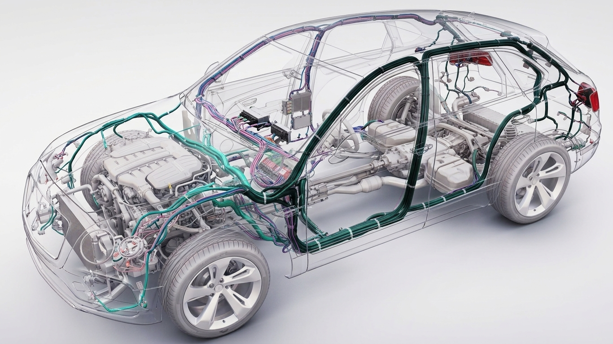

# Chicote Elétrico Automotivo

Site interativo e educativo sobre o chicote elétrico automotivo. O projeto apresenta conceitos básicos, explica o funcionamento do chicote e permite explorar ramificações e componentes diretamente sobre a imagem de um veículo.

O foco principal é a seção **“Explore o Chicote”**, que possui oito pontos interativos. Cada ponto apresenta o nome da região, aplica um zoom leve e exibe informações detalhadas abaixo da imagem.

## Tecnologias utilizadas

- HTML5
- CSS3
- JavaScript puro
- Suporte a SVG para futuras ilustrações vetoriais
- Nenhum framework
- Nenhuma API externa
- Nenhum banco de dados
- Nenhuma dependência ou serviço pago

> A versão atual não usa SVG para os hotspots. Os pontos interativos são botões HTML posicionados sobre a imagem. Isso facilita o uso no celular e a manutenção do projeto.

## Estrutura dos arquivos

```text
CHICOTE_interativo/
├── assets/
│   └── carro.jpeg       # Imagem principal do veículo e do chicote
├── index.html           # Conteúdo e estrutura de todas as seções
├── styles.css           # Aparência, animações e responsividade
├── script.js            # Menu e interação da seção Explore o Chicote
└── README.md            # Documentação do projeto
```

### `index.html`

Contém a capa, as seções introdutórias, a navegação do Explore, os oito pontos sobre a imagem, o painel de informações, a seção de falha e o rodapé.

### `styles.css`

Contém as cores, tipografia, espaçamentos, estados dos pontos, zoom da imagem, tooltips e regras para desktop, tablet e celular.

### `script.js`

Contém os textos definitivos dos hotspots, coordenadas de foco, seleção dos pontos, sincronização com a navegação textual, posicionamento dos tooltips e abertura/fechamento das informações.

### `assets/`

Armazena as imagens utilizadas pelo site. Atualmente contém `carro.jpeg`.

## Como abrir o projeto

### Opção mais simples

Abra o arquivo `index.html` diretamente em um navegador moderno.

### Usando um servidor local

No terminal, entre na pasta do projeto e execute:

```bash
python3 -m http.server 8000
```

Depois acesse:

```text
http://localhost:8000
```

Não é necessário instalar pacotes ou executar um processo de compilação.

## Como trocar a imagem principal do chicote

A imagem atual está em:

```text
assets/carro.jpeg
```

Ela é carregada no `index.html` pelo seguinte elemento:

```html

```

Há duas maneiras de trocar a imagem:

1. Substituir `assets/carro.jpeg` por outro arquivo com o mesmo nome.
2. Adicionar outra imagem à pasta `assets` e alterar o atributo `src` no `index.html`.

A imagem atual utiliza a proporção aproximada de **1366 × 768 (16:9)**. Essa proporção também aparece em `.veiculo-canvas`, no `styles.css`:

```css
.veiculo-canvas {
  aspect-ratio: 1366 / 768;
}
```

Para preservar o alinhamento dos pontos, prefira uma nova imagem com a mesma proporção e enquadramento semelhante. Se a proporção, o recorte ou a posição do veículo mudar, será necessário reposicionar todos os pontos.

## Como alterar os pontos do “Explore o Chicote”

Os pontos visíveis ficam no `index.html`, dentro de:

```html
<div class="pontos-imagem">
```

Exemplo de ponto:

```html
<button
  class="ponto-hotspot"
  type="button"
  data-hotspot-alvo="motor"
  style="--ponto-x: 30.3%; --ponto-y: 57.7%"
  aria-label="Explorar Ramificação do motor">
</button>
```

### Alterar a posição

Edite as variáveis do atributo `style`:

- `--ponto-x`: posição horizontal, da esquerda para a direita.
- `--ponto-y`: posição vertical, de cima para baixo.

Use porcentagens para que o ponto acompanhe a imagem em qualquer largura:

```html
style="--ponto-x: 45%; --ponto-y: 60%"
```

Não use posições fixas em pixels. Como imagem e pontos estão dentro do mesmo contêiner proporcional, as porcentagens mantêm o alinhamento no desktop e no celular.

### Adicionar um ponto

Para adicionar um novo ponto, crie ou atualize cinco partes usando o mesmo identificador:

1. Um botão na navegação textual do `index.html`.
2. Um tooltip com a classe `nome-regiao-ID` no `index.html`.
3. Um botão dentro de `.pontos-imagem` com `data-hotspot-alvo="ID"`.
4. Uma entrada com a mesma chave no objeto `regioes`, no `script.js`.
5. Um seletor no `styles.css` para tornar o tooltip visível quando a região estiver ativa.

Exemplo resumido:

```html
<button type="button" data-hotspot-alvo="novo-ponto">Novo ponto</button>

<span class="nome-regiao nome-regiao-novo-ponto" aria-hidden="true">
  Novo ponto
</span>

<button
  class="ponto-hotspot"
  type="button"
  data-hotspot-alvo="novo-ponto"
  style="--ponto-x: 50%; --ponto-y: 50%"
  aria-label="Explorar Novo ponto">
</button>
```

No `script.js`:

```js
'novo-ponto': {
  nome: 'Novo ponto',
  focoX: 50,
  focoY: 50,
  tipo: 'principal',
  oQue: 'Texto de apresentação.',
  faz: 'Texto sobre a função.',
  importancia: 'Texto sobre a importância.'
}
```

No `styles.css`:

```css
.veiculo-canvas[data-regiao-ativa="novo-ponto"] .nome-regiao-novo-ponto {
  opacity: 1;
  transform: translateY(0);
}
```

Os valores `focoX` e `focoY` definem o ponto de origem do zoom em porcentagem. Normalmente eles devem ficar próximos de `--ponto-x` e `--ponto-y`, mas podem ser ajustados para melhorar o enquadramento.

Para um componente secundário, use `tipo: 'secundario'` e adicione a classe `ponto-secundario` ao botão da imagem.

### Remover um ponto

Remova as mesmas cinco partes: item da navegação, tooltip, botão sobre a imagem, entrada no objeto `regioes` e seletor de visibilidade do tooltip no CSS.

O valor de `data-hotspot-alvo` precisa ser exatamente igual à chave usada no objeto `regioes`. Essa correspondência liga o ponto e a navegação ao conteúdo correto.

## Como alterar os textos dos hotspots

Os textos ficam no objeto `regioes`, no início do arquivo `script.js`.

Cada região possui:

```js
{
  nome: 'Nome exibido',
  oQue: 'Resposta para O que é',
  faz: 'Resposta para O que faz',
  importancia: 'Resposta para Por que é importante'
}
```

- `nome`: título mostrado no tooltip e nas informações.
- `oQue`: conteúdo da coluna “O que é”.
- `faz`: conteúdo da coluna “O que faz”.
- `importancia`: conteúdo da coluna “Por que é importante”.

Se o nome mudar, atualize também o texto do tooltip e o `aria-label` do ponto no `index.html`.

## Como alterar a navegação textual

A navegação fica no `index.html`, dentro de:

```html
<nav class="navegacao-hotspots">
```

Ela é dividida em dois grupos:

- Ramificações
- Componentes

Exemplo:

```html
<button type="button" data-hotspot-alvo="motor">Motor</button>
```

O atributo `data-hotspot-alvo` deve continuar igual ao identificador definido no `script.js` e no ponto correspondente da imagem.

## Como trocar as imagens da seção de falha

Os três placeholders ficam na seção `#falhas`, no `index.html`, e usam a classe:

```html
falha-imagem-placeholder
```

Para inserir uma imagem real, substitua o bloco do placeholder por:

```html

```

Exemplo:

```html
<article class="falha-etapa">
  
  <h3>Funcionamento normal</h3>
  <p>...</p>
</article>
```

A proporção atual é **16:10**, definida no `styles.css`:

```css
.falha-imagem-placeholder,
.falha-imagem {
  aspect-ratio: 16 / 10;
}
```

Prefira imagens com a mesma proporção. A classe `.falha-imagem` já utiliza `width: 100%` e `object-fit: cover`, mantendo a responsividade.

## Como alterar as cores

As cores principais estão no início do `styles.css`, dentro de `:root`:

```css
:root {
  --azul-escuro: #071b33;
  --azul-profundo: #0a2443;
  --azul: #1167dc;
  --azul-claro: #5db9ff;
  --gelo: #f4f7fa;
  --linha: #dbe3eb;
  --texto: #112338;
  --cinza: #66788a;
  --branco: #fff;
}
```

Altere preferencialmente essas variáveis, em vez de trocar cores isoladas em vários seletores. Depois de qualquer mudança, verifique o contraste dos textos, botões, pontos e estados de foco.

## Como alterar os textos introdutórios

Os textos ficam diretamente no `index.html`:

- **O que é o chicote:** seção `.introducao`, com `id="entenda"`.
- **Como ele funciona:** seção `.funcionamento`.
- **O que ele conecta:** seção `.conexoes`, com `id="conexoes"`.

Os títulos usam `h2`, os subtítulos e textos de apoio usam elementos `p`, e as categorias de “O que ele conecta” ficam dentro de `.lista-conexoes`.

## Responsividade

O layout usa grades flexíveis, porcentagens, `clamp()` e duas faixas principais no `styles.css`:

```css
@media (max-width: 900px) { ... }
@media (max-width: 640px) { ... }
```

Em telas menores:

- o menu principal vira um botão;
- as seções com colunas são empilhadas;
- o fluxo de “Como ele funciona” passa para o formato vertical;
- a navegação do Explore permite rolagem horizontal;
- a imagem ocupa a largura disponível;
- as informações do hotspot aparecem em uma coluna;
- as etapas de falha são empilhadas;
- o rodapé passa para uma coluna.

Os pontos mantêm posições relativas à imagem. O círculo visível é pequeno, mas possui uma área de toque invisível maior para facilitar o uso no celular.

## Cuidados importantes

- Não altere a proporção ou o enquadramento da imagem principal sem revisar os oito pontos.
- Teste todos os pontos depois de trocar a imagem, posições ou identificadores.
- Mantenha `data-hotspot-alvo` igual à chave correspondente no objeto `regioes`.
- Teste sempre em desktop e celular.
- Verifique especialmente larguras próximas de 320, 375, 430, 768 e 1440 pixels.
- Não reintroduza hitboxes grandes ou invisíveis sobre regiões extensas.
- Não adicione overlays que cubram ou alterem toda a fotografia.
- Não use posições em pixels para alinhar os pontos sobre a imagem.
- Mantenha textos alternativos em todas as imagens.
- Preserve botões nativos para manter teclado e acessibilidade.
- Mantenha o projeto sem frameworks, APIs externas e dependências pagas.

## Checklist rápido antes de apresentar

- [ ] Abrir o site e conferir o carregamento inicial.
- [ ] Testar o botão principal da capa.
- [ ] Testar os oito pontos sobre a imagem.
- [ ] Conferir se cada ponto abre o texto correto.
- [ ] Testar todos os itens da navegação textual do Explore.
- [ ] Abrir e fechar as informações dos hotspots.
- [ ] Verificar a imagem principal e as imagens/placeholders da seção de falha.
- [ ] Testar o menu e o layout no celular.
- [ ] Testar o layout no tablet e no desktop.
- [ ] Verificar se não existe rolagem horizontal indesejada.
- [ ] Abrir o console do navegador e confirmar que não existem erros.
